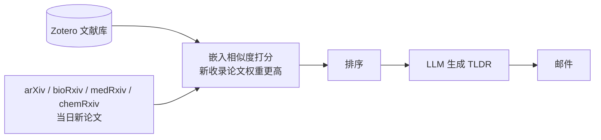
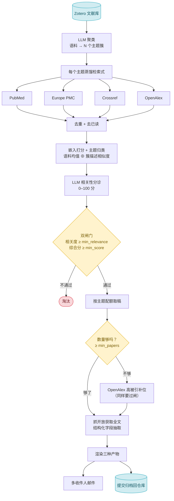

# CMC 生物药文献周报

  

**每周自动从 PubMed / Europe PMC / Crossref / OpenAlex 检索新文献，比对你的 Zotero 库主题，用 LLM 判定是否真的与生物药 CMC（化学、生产与控制）分析相关，生成中文结构化摘要，发邮件、存进仓库——全程跑在 GitHub Actions 免费额度内，不需要自己的服务器。**

Fork 自 [TideDra/zotero-arxiv-daily](https://github.com/TideDra/zotero-arxiv-daily)，一个按 Zotero 库每日推荐 arXiv 论文的工具。这份 fork 保留了那条日报管线，并在此之上长出了一整条独立的**周报管线**——这是本仓库存在的理由，也是这份文档的重点。

---

## 目录

1. [项目背景与动机](#1-项目背景与动机)
2. [这个项目做什么](#2-这个项目做什么)
3. [核心功能一览](#3-核心功能一览)
4. [项目结构](#4-项目结构)
5. [架构与运行流程](#5-架构与运行流程)
6. [文章是怎么选出来的](#6-文章是怎么选出来的)
7. [快速开始](#7-快速开始)
8. [配置详解](#8-配置详解)
9. [产物与归档](#9-产物与归档)
10. [预检](#10-预检)
11. [注意事项与排错](#11-注意事项与排错)
12. [已知问题与待改进](#12-已知问题与待改进)
13. [本地开发与贡献指南](#13-本地开发与贡献指南)
14. [开发历史](#14-开发历史)
15. [许可与致谢](#许可与致谢)

---

## 1. 项目背景与动机

**要解决的问题：** 一个生物药 CMC（化学、生产与控制）分析科学家的信息源分散在至少四类数据库里——PubMed、Europe PMC、Crossref、OpenAlex——横跨色谱、质谱、蛋白质组学、免疫学、药剂学等十几个方向的期刊。人工每周登录几个网站、拼关键词、逐篇读摘要筛相关性，做不到可持续。

**为什么不能直接用现成的文献推送工具：**

- **通用 RSS / 关键词订阅**要么召回率低（漏掉方法学能迁移到生物药、但研究对象不是生物药的论文），要么精度低——"色谱""质谱"这类词面重合会把不相关领域的论文一起塞进来。这不是假设：本仓库首期周报（相关性闸门上线前）就真实混进过一篇讲钠离子电池负极材料的论文，只因为它用了"多模式原位表征"这类词面上像色谱/质谱方法学的表述（完整案例见[第 6 节](#6-文章是怎么选出来的)）。
- **上游 zotero-arxiv-daily** 做的是"日报"：每天比对 Zotero 库和 arXiv/bioRxiv/medRxiv/chemRxiv 当日新预印本的嵌入相似度。这条逻辑本身没问题，但对 CMC 科学家有两处根本不适配——预印本库基本不覆盖分析化学/药学同行评审期刊，而 CMC 文献恰恰主要发在这些期刊上，不是 arXiv；而且"和我的库像不像"是纯几何相似度，不含任何"这篇到底是不是生物药"的语义判断。

**这个 fork 做的事：** 在保留上游日报管线的同时，新增一条独立的**周报管线**——不再被动等预印本"投喂"，而是主动用 Zotero 库反推出该检索什么主题，去四个真正覆盖期刊文献的数据库查询，再叠加一层专门针对"生物药 CMC 相关性"的 LLM 判定，把纯词面相似的噪音挡在外面。设计目标不是"尽量多推荐"，是**宁缺毋滥**：科学家的阅读时间比漏掉一篇文献更贵。

## 2. 这个项目做什么

一句话：每周把和你 Zotero 库相关、且经过相关性判定确实是生物药 CMC 方向的新文献选出来，生成中文结构化摘要，发邮件、存进仓库。

下面是首期周报（`reports/2026/2026-08-W3.md`）「本周优先读」第一条的真实节选：

```markdown
## 本周优先读

- [Comparative Orthogonal RP-UHPLC and SEC-UHPLC Methods for Quantitative
  Analysis and Integrity Assessment of Cetuximab-Based Antibody–Drug
  Conjugates](https://doi.org/10.3390/separations13080236)
  Separations · 2026-08-18 · Cuffaro Doretta et al.

### Comparative Orthogonal RP-UHPLC and SEC-UHPLC Methods for Quantitative
    Analysis and Integrity Assessment of Cetuximab-Based Antibody–Drug
    Conjugates

Separations · 2026-08-18 · Cuffaro Doretta et al.
DOI: <https://doi.org/10.3390/separations13080236>

**背景：** 抗体药物偶联物（ADC）结构复杂，其定量表征常受载荷相关干扰和分子
异质性影响，需要开发可靠的分析方法。

**待解决的问题：** 此前尚缺乏将反相与体积排阻超高效液相色谱联用、同时对ADC
进行定量和完整性评估的互补性方法，尤其是针对西妥昔单抗（Cetuximab）类ADC。
```

这一期是在相关性闸门上线**之前**跑的，所以「方法/结论/洞见」还是整段文字，标题下也没有相关度徽标行——现在的管线会把这三个字段拆成有序列表，并在标题下加一行形如 `相关度 82 · 核心期刊` 的徽标（见[第 6、8 节](#6-文章是怎么选出来的)）。之所以仍然用这一期举例，是因为它就是催生相关性闸门这次改造的原始证据：同一期里混进了一篇讲钠离子电池负极材料的论文，与生物药毫无关系——第 6 节会具体讲清楚新闸门怎么把这类稿子拦下。

**与上游的关系一句话概括：** 日报管线（`main.py`）原样保留，逻辑与上游一致；插件式注册表、Hydra 配置组合模式沿用；AGPLv3 许可证与上游依赖不变。真正新增的是整条周报管线，以及支撑它的相关性闸门、结构化字段、预检——这些是本仓库存在的理由，逐一展开在[第 3](#3-核心功能一览)、[5](#5-架构与运行流程)、[6](#6-文章是怎么选出来的) 节。

## 3. 核心功能一览

**日报管线**（继承自上游，原样保留）

- ✅ 按 Zotero 库嵌入相似度，从 arXiv / bioRxiv / medRxiv / chemRxiv 当日新论文里挑出最相关的一批（手动触发，不自动排程，见[第 5 节「自动排程」](#5-架构与运行流程)）
- ✅ LLM 生成英文 TLDR，邮件推送

**周报管线**（本仓库新增，核心）

- ✅ Zotero 语料 LLM 主题聚类 + 每个主题检索式蒸馏——检索目标来自你的库，不是写死的关键词
- ✅ 四源检索：PubMed / Europe PMC / Crossref / OpenAlex
- ✅ 跨源去重 + 跨周去重，同一篇文献不会连续投递两次
- ✅ 嵌入打分 + 主题归类（语料均值 ⊕ 簇描述相似度加权，纠正纯词面重合导致的归簇偏差）
- ✅ **LLM 相关性分诊 + 综合分双闸门**——挡住"词面像但领域不对"的论文，本仓库的核心改造
- ✅ 期刊 / 企业名单加分：命中 63 本核心期刊或 52 家产业单位的稿子排名更靠前
- ✅ 按主题配额选稿，冷门主题不被热门主题挤没；数量不足自动用高被引论文补位
- ✅ 开放获取全文阶梯式抓取 + 结构化字段抽取（背景 / 待解决问题 / 方法 / 结论 / 洞见）
- ✅ 三种产物：markdown 归档、网页 HTML（左侧目录 + 全文编号）、邮件 HTML
- ✅ 多收件人（Bcc 互相隐藏）投递 + 附件大小预算
- ✅ 产物自动 commit + push 回仓库——GitHub Actions 的 runner 是一次性的，不推送就丢了

**辅助能力**

- ✅ 预检：7 项检查，正式跑之前把配置和外部依赖的问题暴露出来
- ✅ 月度综述：可选，跨周归纳，独立运行、挂了不影响周报

## 4. 项目结构

标了「〔生成〕」的目录不是手写的，是管线每次跑完自动 `commit` 回仓库的产物；其余是手写的源码和配置。

```
zotero-arxiv-daily/
├── src/zotero_arxiv_daily/        核心代码，模块级说明见下表
├── config/
│   ├── default.yaml                  Hydra 组合入口：先 base 再 custom（见第 8 节）
│   ├── base.yaml                     默认值、长名单（期刊/企业）、报告字段定义，提交在 git 里
│   └── custom.yaml                   本地跑/读测试默认值用的示例；CI 中被 CUSTOM_CONFIG 整份覆写
├── tests/                          测试，目录结构与 src/ 一一对应
├── docs/
│   ├── cmc-literature-weekly-plan.md   周报管线的设计文档：需求、架构决策的完整讨论过程
│   └── cmc-weekly-setup.md             部署与首跑实测记录，含可直接复制的 CUSTOM_CONFIG 样例
├── assets/                         README 用到的配置截图
├── .github/workflows/              main.yml（日报）/ weekly.yml（周报）/ monthly.yml / preflight.yml / ci.yml / keep-alive.yml（防自动禁用，见第 5 节）
│
├── reports/YYYY/YYYY-MM-Wn.md      〔生成〕周报 markdown，每周一份，永久归档
├── reports/YYYY/YYYY-MM-Wn.html    〔生成〕周报网页版，左侧目录 + 全文编号（见第 9 节）
├── library/YYYY/YYYY-MM-Wn/*.pdf   〔生成〕当周抓到的开放获取全文，命名规则见第 9 节
├── state/
│   ├── theme_clusters.json           〔生成〕主题聚类缓存
│   ├── query_profiles.json           〔生成〕检索式蒸馏缓存
│   ├── seen_dois.json                〔生成〕跨周去重记录
│   └── corpus_vectors.npz            〔生成，可选〕语料 embedding 缓存，配置了 reranker.vector_cache 才有
│
├── CHANGELOG.md                    开发历史（见第 14 节）
├── README.md                       就是这份文档
└── LICENSE                         AGPLv3
```

`src/zotero_arxiv_daily/` 内部按「日报专用 / 周报专用 / 两条共用」分区；子目录对应[第 5 节](#5-架构与运行流程)表格里的三套插件式注册表：

```
src/zotero_arxiv_daily/
├── main.py                日报管线入口（@hydra.main）
├── weekly.py               周报管线入口，WeeklyExecutor 编排全部 9 个阶段
├── monthly.py              月度综述入口，独立运行，可选
├── preflight.py            预检入口，跑之前探测每个外部依赖（见第 10 节）
├── executor.py             Executor 基类：拉取/过滤 Zotero 语料，日报检索编排
├── protocol.py             Paper / CorpusPaper 数据类；Paper 挂 LLM 方法（生成 TLDR、提取单位）
├── construct_email.py      日报的邮件 HTML 渲染（上游遗留；周报的渲染在 report.py/mailer.py）
├── utils.py                共享工具（glob 匹配、prompt 截断等）
│
├── retriever/                     检索器插件：@register_retriever（日报）/ @register_query_retriever（周报）
│   ├── base.py                      日报检索器基类：_retrieve_raw_papers() / convert_to_paper()
│   ├── arxiv_retriever.py           arXiv（日报）
│   ├── biorxiv_retriever.py         bioRxiv（日报）
│   ├── medrxiv_retriever.py         medRxiv（日报）
│   ├── chemrxiv_retriever.py        chemRxiv，经 Crossref（日报）
│   ├── query_base.py                周报检索器基类：接受一条检索式 + 起止日期
│   ├── pubmed_retriever.py          PubMed E-utilities（周报）
│   ├── europepmc_retriever.py       Europe PMC（周报）
│   ├── crossref_retriever.py        Crossref（周报）
│   └── openalex_retriever.py        OpenAlex；兼职经典补位来源（周报）
│
├── reranker/                      相似度插件：@register_reranker，两条管线共用
│   ├── base.py                      BaseReranker：similarity_matrix / get_similarity_score / 时间衰减权重
│   ├── local.py                     sentence-transformers 本地模型
│   ├── api.py                       OpenAI 兼容 embedding API
│   └── vector_cache.py              跨周缓存语料 embedding（周报）
│
├── search/                        周报专用：把 Zotero 语料变成检索目标
│   ├── cluster.py                   LLM 把语料聚成主题簇；候选归簇（语料均值 + 簇描述相似度加权）
│   └── profile.py                   每个主题蒸馏出三种检索式（PubMed 布尔式 / Crossref 自然语言 / OR 词表）
│
├── fulltext/
│   └── resolver.py                开放获取全文阶梯式抓取；PDF 命名为「年份-作者-标题-哈希」（周报）
│
├── dedup.py                DOI 归一化、跨源去重、跨周去重（`state/seen_dois.json`，周报）
├── triage.py                LLM 判定候选与生物药 CMC 的相关度，0–100 分（周报）
├── scoring.py               相关度 + 期刊/企业加分 → 综合分；双闸门判定（周报）
├── affiliation.py           从检索源元数据提取作者单位，匹配期刊/企业名单（周报）
├── quota.py                 按主题 sqrt 配额分配名额（周报）
├── backfill.py               不足 `min_papers` 时用 OpenAlex 高被引论文补位（周报）
├── extract.py                按 `report.fields` 配置抽取结构化字段（周报）
├── report.py                 渲染三种产物：markdown / 网页 HTML（侧栏目录+编号）/ 邮件 HTML（周报）
├── mailer.py                 多收件人（Bcc）投递 + 附件大小预算（周报）
├── publish.py                 把产物写盘、commit、push 回仓库（周报/月度）
└── weeknum.py                周编号与产物路径命名，如 `2026-08-W3`（周报）
```

## 5. 架构与运行流程

两条流水线彼此独立，可以只启用其中一条。

### 日报（`main.py`，继承自上游）



### 周报（`weekly.py`，本仓库新增）



「主题归类」（图中 `SC` 节点）不是纯粹的向量最近邻：候选文献落进哪个簇，由「和簇内语料成员的平均相似度」与「和簇的一句话主题描述的相似度」加权得出，后者权重更高（默认 0.6，`search.cluster_assignment_description_weight`）——语料均值是弥散信号，容易被词面重合带偏；主题描述是更精确的锚点，见[第 6 节](#6-文章是怎么选出来的)的真实案例。

### 三套插件式注册表

| 注册表 | 装饰器 | 查找函数 | 服务谁 | 现有实现 |
| --- | --- | --- | --- | --- |
| retriever | `@register_retriever(name)` | `get_retriever_cls()` | 日报 `executor.source` | `arxiv` `biorxiv` `medrxiv` `chemrxiv` |
| query retriever | `@register_query_retriever(name)` | `get_query_retriever_cls()` | 周报 `search.sources` | `pubmed` `europepmc` `crossref` `openalex` |
| reranker | `@register_reranker(name)` | `get_reranker_cls()` | 两条管线共用的 `executor.reranker` | `local`（sentence-transformers）`api`（OpenAI 兼容 embedding） |

新增一个来源/reranker 怎么写，见[第 13 节](#13-本地开发与贡献指南)。

数据类：`Paper` 与 `CorpusPaper` 定义在 `src/zotero_arxiv_daily/protocol.py`；`Paper` 上挂着调 LLM 的 `generate_tldr()` / `generate_affiliations()`，相关性分诊的结论存在 `paper.triage`（`TriageResult`：`relevance` / `reason` / `modalities`），综合分存在 `paper.scoring`。

### 自动排程（schedule / cron）与保活

三个工作流靠 GitHub Actions 的 `schedule` 触发器定时跑；日报（`main.yml`）现在没有排程，只能手动触发（见[第 7 节](#7-快速开始)）。

| 工作流 | 文件 | cron | 触发时间（UTC / 北京时间） |
| --- | --- | --- | --- |
| 周报 | `weekly.yml` | `0 12 * * 5` | 每周五 12:00 / 周五 20:00 |
| 月度综述 | `monthly.yml` | `0 13 1 * *` | 每月 1 号 13:00 / 21:00，可选 |
| 保活 | `keep-alive.yml` | `0 0 */30 * *` | 约每 30 天一次，0:00 / 8:00 |

cron 是 5 个字段，从左到右分别是分钟（0–59）、小时（0–23）、日（1–31）、月（1–12）、星期（0–6，0 是周日）；`*` 表示不限制，`/N` 表示步进。`0 12 * * 5` 读作「0 分 12 时，不管几号、不管几月，只要是周五」。GitHub Actions 的排程有几条容易忽略的限制：

- **只认 UTC，没有时区设置**，换算成北京时间要 **+8**。
- **高峰期可能延迟几分钟到十几分钟，不保证准点触发**——整点、UTC 0 点这类大家都爱用的时间点排队的 workflow 特别多。
- **最短间隔 5 分钟**，写得更密会被 GitHub 忽略。
- **「日」和「星期」两个字段是或的关系**：同时给出非 `*` 值时，命中一个就触发，不是两个都要满足——本仓库现有的 cron 都只用了其中一个字段，自己写新的要留意。
- **只按默认分支（本仓库是 `main`）上的 workflow 文件生效**：改了 cron 要先 push 到 main，下一次触发才生效，正在排队的那次不受影响。
- **仓库超过 60 天没有任何 commit，GitHub 会自动禁用这个仓库里所有的 scheduled workflow**——这条限制是 `keep-alive.yml` 存在的唯一原因。

**`keep-alive.yml` 是做什么的：** 它自己每 30 天在 `.github/keep-alive.txt` 里写一行时间戳并提交，制造一次 commit，专门用来防止上面那条 60 天自动禁用规则被触发。它保护的是仓库里**全部**还在用排程的 workflow（`weekly.yml`、`monthly.yml`），不是针对某一个——只要周报还想自动跑，这个工作流就不能删。

**改排程：** 编辑对应 `.github/workflows/*.yml` 里的 `cron:` 那一行，提交推送到 `main`。cron 写错不会报错，只会在该触发的时候悄悄不触发；改完最好去 Actions 页面手动 Run workflow 确认一遍管线本身没问题，排程是否生效只能等下一次真正到点才能验证。

## 6. 文章是怎么选出来的

新手最常见的困惑是「这篇为什么进了周报、那篇为什么没有」。选文其实是一段两段式漏斗：先检索出一个大候选池，用嵌入相似度粗排，再用 LLM 逐篇判定「是不是真的和生物药相关」，最后按综合分和主题配额选定、不够再补位。下表逐级列出每一步淘汰了什么、由哪个参数控制：

| 阶段 | 淘汰了什么 | 由哪个参数控制 |
| --- | --- | --- |
| 主题聚类 + 检索式蒸馏 | —（决定去检索什么，不淘汰候选） | `search.n_clusters` |
| 多源检索 | —（决定候选池有多大） | `search.sources`、`search.per_cluster_limit` |
| 去重 / 去已读 | 重复 DOI、库里已有的、往期已投递过的 | `search.seen_state` |
| 嵌入打分 | —（只排序，决定谁先送分诊，不淘汰） | `executor.reranker` |
| 送分诊 | 嵌入相似度最低的一批（这是成本上限，不是质量判断） | `report.triage_pool` |
| **相关性分诊** | **与生物药无关、或迁移价值很低的文献** | `report.triage_batch` |
| **相关度硬下限** | **仅名词/技术表面重合、真要迁移得重新开发的（20–54 分档）** | `report.min_relevance` |
| **综合分闸门** | **相关度过了、但综合分仍不够优的** | `report.min_score`、`report.journals.bonus`、`report.industry.bonus` |
| 主题配额 | 单个主题候选过度集中时，超出名额的部分 | `report.max_papers`、`report.min_per_cluster` |
| 经典补位 | —（不淘汰，只补数量。补位候选同样过相关度与综合分两道闸，但**不要求**落进当周的某个具体主题；一轮补不满会换检索式再来，最多 3 轮） | `report.min_papers` |
| 特定主题（可选） | 与你指定主题不对题的（**不限日期**，检索覆盖全部年份；用的是"与该主题相关吗"这把尺子，且主题点名了具体对象时，研究别的对象的文献即使方法邻近也不放行） | `search.focus.*` |

### 用首期真实数据走一遍

[第 2 节](#2-这个项目做什么)引用的首期周报（`reports/2026/2026-08-W3.md`，2026-08-14 ~ 2026-08-21，共 25 篇）是在这套闸门上线**之前**跑的，选文只靠嵌入相似度排序和主题配额——这正是催生本次改造的原始证据。用它举三个具体例子：

**钠离子电池那篇会在哪一步被拦下。** 那一期混进了一篇《The First Electrochemical Cycle: State-of-Charge Dependent Formation and Evolution of the Solid Electrolyte Interphase on Hard Carbon Anodes in Sodium-Ion Batteries》（*Small Methods*，2026-08-14，Schäfer David et al.，DOI `10.1002/smtd.70958`），讲的是钠离子电池硬碳负极固态电解质界面（SEI）的形成过程，与生物药 CMC 没有任何关系。它当初能混进来，是因为「多模式原位表征」一类的词面特征让嵌入相似度误判成了「和你的色谱/质谱文献库像」。分诊评分细则里，`0–19`（无关）档明确把「电池材料」列为必须打低分的反例，这篇会落在这一档；`report.min_relevance: 55` 直接拦下它——期刊加分、企业加分都救不了，这条硬下限就是为这类稿子设的。

**ADC 那篇为什么排在第一。** 同一期「本周优先读」第一条就是[第 2 节](#2-这个项目做什么)引用的那篇 ADC 分析方法论文（*Separations*，DOI `10.3390/separations13080236`）。研究对象本身是抗体药物偶联物（ADC），落在分诊细则 `80–100`（高）档；同时它发在 *Separations*——这本刊在 `report.journals.allow` 名单里，命中后综合分再加 `report.journals.bonus`（默认 10 分）。相关度本身就高，又叠加了期刊命中，两项一起让它在综合分排序里稳居第一，配额分配时自然优先拿到名额。

**壳聚糖酶那篇为什么被分进了「宿主细胞蛋白分析」，以及这处修复后来被证明不够。** 这是闸门上线**之后**实测发现的第二个问题：一篇讲疫苗效力检测（用壳聚糖酶消除壳聚糖佐剂对效价测定的干扰）的论文，正确通过了闸门（相关度 92，命中企业加分），但被归到了「宿主细胞蛋白（HCP）分析」这个簇下——内容跟 HCP 毫无关系。根因是当时候选归簇纯靠候选文献和簇内语料成员的**平均**相似度决定，而这个簇里恰好聚了不少讲蛋白质定量分析方法的文献，词面上的方法学重合把它带偏了。第一次修复让候选归簇同时看簇的**一句话主题描述**，且这个信号权重更高（默认 0.6）——当时只有单元测试验证，尚未经真实候选验证（[第 12 节](#12-已知问题与待改进)如实记了这一点）。

后来一次自然重跑给出了答案：不够。同一份 `reports/2026/2026-08-W3.md`（闸门和描述加权都已生效的版本）里，「宿主细胞蛋白（HCP）分析」簇下的两篇文献——一篇讲 infliximab 人源化改造与可开发性评估（AC-SINS、SE-HPLC 筛选自聚集与多特异性），另一篇讲哺乳动物细胞培养的水动力学应力——都正确通过了相关性闸门（相关度 95、85），却没有一篇真正涉及 HCP 检测；「色谱电泳纯度与含量分析」簇下混进了两篇疫苗文献（RNA-LNP 完整 RNA 定量、HIV-1 包膜糖蛋白聚糖屏障分析），Zotero 库里完全没有对应文献；「电荷异质性与电泳分离分析」簇（当周仅 1 篇）实际是一篇动脉粥样硬化斑块空间蛋白质组学论文，跟电荷变异体或电泳分离毫无关系，只是命中了核心期刊加分；「免疫分析与酶学检测」簇（当周仅 1 篇）是一篇植物叶绿体生产工业酶（用于废水处理）的论文，也不属于免疫分析或酶学检测方法。四处误归类有一个共同点：候选本身确实和「生物药 CMC」这个大范畴沾边（分诊相关度都在及格线以上），只是不属于它被塞进的那个具体主题——描述加权只是让归簇的嵌入信号更准一点，但嵌入相似度终究分不清「整体相关」和「具体属于这个主题」，二者是两个不同粒度的问题。

真正的修复落在分诊阶段，而不是继续调嵌入权重：分诊 LLM 现在除了打相关度分，还会看到库里当前的全部主题名称和一句话描述，对每篇文献单独判断「具体属于哪一个主题、还是都不属于」——判定「都不属于」的文献即使相关度再高也会被剔除，不再靠嵌入相似度硬塞进某个簇；判定属于某个主题则会覆盖归簇阶段给出的初始归类。这是比"是否与生物药 CMC 相关"更严格的独立判断，见 `triage.py` 的 `_apply_theme_verdicts()`、`weekly.py` 的 `_gate()`。和上一次一样，这处修复同样如实标注了验证边界，见[第 12 节](#12-已知问题与待改进)。

### 调参对照表

| 症状 | 先动这个参数 | 往哪个方向 |
| --- | --- | --- |
| 周报太杂（进了不少沾边但不该进的） | `report.min_relevance` / `report.min_score` | 调高。同时查一下是不是有覆盖全学科的大刊（如 *PLoS ONE*、*Nature Communications*）在 `report.journals.allow` 里把不太相关的稿子用加分顶了上来——从名单里单独移除即可，不影响机制 |
| 周报太薄（总凑不满 `min_papers`，全靠补位） | `report.min_relevance` / `report.min_score` | 调低（不建议低于 55——那是分诊细则「中」档的下沿，再低就进了「低」档）；也可以调高 `report.triage_pool`，让更多候选有机会被分诊看到，而不是在嵌入排序阶段就被挡在门外 |
| 有个方向库里还没有文献，但想开始追 | `search.focus.topic`（配合 `FOCUS_TOPIC`） | 填上这个主题；它不依赖 Zotero 语料，会单列一节，相关度按这个主题判定，与库内主题互不影响 |
| 某个方向总是漏（比如某个主题总凑不满配额） | `report.min_per_cluster`、`search.per_cluster_limit` | 调高，给这个主题在配额分配里留保底名额、在检索阶段留更大的候选池；同时检查 `report.journals.allow` / `report.industry.names` 是不是漏收了这个方向常发的期刊或企业 |

`min_relevance: 0` 且 `min_score: 0` 等价于关掉闸门，退回旧行为，便于对照排查是不是闸门本身的问题。

## 7. 快速开始

1. **Fork（并 Star）本仓库。** 建议保持私有——周报正文会带着你 Zotero 库的主题信息，且抓下来的 PDF 会提交进仓库。

   
   *截图是 GitHub 旧版界面，仅示意 Fork/Star 按钮大致在哪；当前 GitHub 页面布局略有不同，但都在仓库页右上角。*

2. **配置 Secrets**（仓库 Settings → Secrets and variables → Actions → **Secrets** 标签）。两条管线都要用到 `ZOTERO_ID`、`ZOTERO_KEY`、`SENDER`、`SENDER_PASSWORD`、`OPENAI_API_KEY`、`OPENAI_API_BASE`；只想跑周报还需要额外几个（完整清单、去哪申请见[第 8 节](#8-配置详解)和 [`docs/cmc-weekly-setup.md`](docs/cmc-weekly-setup.md) 第 2 节）。

   
   *页面路径（Settings → Secrets and variables → Actions → Secrets 标签 → New repository secret）没变；截图里列出的密钥名称是旧版示例，本仓库实际要填的名称以第 8 节的表格为准。*

3. **配置 `CUSTOM_CONFIG` 变量**（同一页面 → **Variables** 标签）。这是运行时真正生效的配置来源，具体怎么写、和 `config/base.yaml` 怎么分工，见[第 8 节](#8-配置详解)；周报专用的完整样例见 [`docs/cmc-weekly-setup.md`](docs/cmc-weekly-setup.md) 第 1 节，可以直接复制粘贴。

   
   *Name 固定填 `CUSTOM_CONFIG`；Value 框里粘贴的内容以 [`docs/cmc-weekly-setup.md`](docs/cmc-weekly-setup.md) 第 1 节的完整样例为准，截图只演示填在哪个框。*

4. **跑一次预检**：Actions → **CMC weekly preflight** → Run workflow。全绿再进行下一步；有 `FAIL` 先按提示修（[第 10 节](#10-预检)讲每一项验证什么）。

   
   *手动触发都是这个路径：Actions → 左侧选中对应 workflow → 右侧 Run workflow → 选分支 → 再点一次 Run workflow。预检和第 5 步的正式跑都用这个操作。*

5. **手动触发一次正式跑**：日报是 **Send emails daily**，周报是 **CMC literature weekly digest**。周报、月度综述之后会按各自的排程自动跑；日报没有排程，只能这样手动跑。各工作流具体几点触发、cron 怎么改，见[第 5 节「自动排程」](#5-架构与运行流程)。

首次跑周报会比之后每周都慢——主题聚类、检索式蒸馏、语料向量三个缓存都是冷的，之后会命中缓存。首跑该看什么日志、常见的坑，[`docs/cmc-weekly-setup.md`](docs/cmc-weekly-setup.md) 第 4、5 节有实测记录，不在这里重复。

## 8. 配置详解

### 配置文件在哪、怎么改

配置由 Hydra 在运行时合并，顺序见 `config/default.yaml`：

```yaml
defaults:
  - base
  - custom
```

先加载 `config/base.yaml`，再用 `config/custom.yaml` 覆盖。两个文件的分工：

| 文件 | 在哪 | 放什么 |
| --- | --- | --- |
| `config/base.yaml` | 提交在 git 里 | 默认值、长名单（期刊/企业）、报告字段定义 |
| `config/custom.yaml` | **每次 workflow 运行时被整份覆写** | 引用 secrets 的项、与运行环境相关的设置 |

**仓库里那份 `config/custom.yaml` 在 CI 中完全不生效。** `main.yml`、`weekly.yml`、`preflight.yml`（`monthly.yml` 同理）里都有这一行：

```bash
printf "%b\n" "$CUSTOM_CONFIG" > config/custom.yaml
```

`$CUSTOM_CONFIG` 来自仓库 Settings → Secrets and variables → Actions → **Variables** 里的 `CUSTOM_CONFIG` 变量：运行时先把它写进 `config/custom.yaml`，**整份覆盖掉仓库里那份文件的内容**，再启动 Hydra。也就是说，在网页上直接编辑仓库里的 `config/custom.yaml` 文件本身（它现在只是本地跑和读测试默认值时会用到的示例）对线上任何一次运行都没有影响——真正生效的是 `CUSTOM_CONFIG` 这个 Variable。

> ⚠️ **列表整体替换的陷阱。** OmegaConf 合并两层配置时，字典是逐键合并的，但列表是**整体替换**，不是拼接。实测：
>
> ```python
> from omegaconf import OmegaConf
>
> base   = {"report": {"journals": {"bonus": 10, "allow": ["mAbs", "Analytical Chemistry", "Separations"]}}}
> custom = {"report": {"journals": {"allow": ["Nature"]}}}
> OmegaConf.merge(base, custom).report.journals
> # → {"bonus": 10, "allow": ["Nature"]}     ← 三本刊全没了，bonus 还在
> ```
>
> `bonus` 是标量，逐键合并后保留下来；`allow` 是列表，`custom` 里的 `["Nature"]` 把 `base` 里的三本期刊**整个顶替掉**，不是加进去，而且**不会报错、没有任何提示**。这意味着：`report.journals.allow`（63 本期刊）、`report.industry.names`（52 家企业）、`report.fields`（5 个报告字段）这三份长内容**必须写在 `config/base.yaml` 里，绝不能放进 `CUSTOM_CONFIG`**——放进 `CUSTOM_CONFIG` 之后，任何一次「只想加一本期刊」的修改，只要没把其余 62 本重新粘贴一遍，就会静默丢掉它们，下一次周报直接用一份缺了 62 本刊的名单跑，而你不会收到任何警告。`min_relevance`、`min_score` 这几个单个数值没有这个问题，两处都能改，但放 `base.yaml` 能顺带获得 git 的修改历史，所以默认也放在这里。

**两条修改路径：**

1. **改名单 / 改报告字段** → 打开仓库网页 → `config/base.yaml` → 铅笔图标编辑 → 改完 commit。网页编辑器认得 YAML，缩进错了会标红提示——这层保护是 Variables 的纯文本框没有的。
2. **改密钥 / 改收件人** → 仓库 Settings → Secrets and variables → Actions → **Variables** 标签 → 编辑 `CUSTOM_CONFIG`。

   
   *容易和第 7 节配 Secrets 时的 Secrets 标签搞混——同一个页面，标签切到 Variables 才能看到 `CUSTOM_CONFIG`。*

**两条路径改完都要跑一次 preflight**（Actions → CMC weekly preflight → Run workflow）——改名单/字段会被 `report-config` 检查校验（[第 10 节](#10-预检)第 1 项），比跑一次完整周报便宜得多。

**改 Variables 不会影响正在跑的 job。** `${{ vars.CUSTOM_CONFIG }}` 在 job 启动那一刻就解析完毕，之后再改 Variables，那次 job 用的还是启动时的值；改 `config/base.yaml` 同理——workflow checkout 的是触发那一刻的 commit，晚一步的提交要等下一次触发才生效。

### 配置项一览

配置按功能分成几个顶层键，逐节的详细注释就写在 `config/base.yaml` 里，这里给的是导航：

| 顶层键 | 管哪条管线 | 大致内容 |
| --- | --- | --- |
| `zotero` | 两条都用 | `user_id` / `api_key`；`include_path` / `ignore_path` 两组 glob，筛选纳入哪些 Zotero 分类 |
| `source` | 日报（`arxiv`/`biorxiv`/`medrxiv`/`chemrxiv`）+ 周报四个查询源的凭据（`pubmed.api_key`/`email`，`crossref.mailto`，`openalex.mailto`，`europepmc` 无需凭据） | 各来源的类目筛选或联系方式 |
| `email` | 两条都用 | 发信账号、SMTP；`recipients` 是周报专用的多收件人列表，缺省回退到 `receiver` |
| `llm` | 两条都用 | API key/base_url、生成参数、`language`（周报默认中文摘要要显式设成 `中文`） |
| `reranker` | 两条共用 `executor.reranker` 选择 `local`/`api`；`vector_cache` 是周报专用的语料向量缓存路径 | 本地模型或 embedding API 的参数 |
| `executor` | 日报为主 | `source` 选用哪些日报检索器、`reranker` 选择、`max_paper_num` 等 |
| `search` | 周报专用 | `sources`（四个查询源）、`n_clusters`、`per_cluster_limit`、`cluster_assignment_description_weight`（候选归簇时主题描述信号的权重，见[第 5 节](#5-架构与运行流程)）、三个缓存文件路径 |
| `fulltext` | 周报专用 | 是否尝试抓开放获取全文、`unpaywall_email`、单文件大小上限 |
| `search.focus` | 周报可选的第二条检索线：`topic`（留空即关闭）、`background`、`min_papers`/`max_papers`/`min_relevance`。库内主题从 Zotero 语料聚出来，这一节是你自己点名要追的方向，可以与库内主题完全无关 |
| `report` | 周报专用，**新手最常改的部分** | 数量控制（`min_papers`/`max_papers`/`top_picks`/`min_per_cluster`）、闸门（`min_relevance`/`min_score`/`triage_pool`/`triage_batch`，见[第 6 节](#6-文章是怎么选出来的)）、`journals`/`industry` 两份加分名单（见上方的列表陷阱）、`fields` 报告字段定义（见下） |
| `git` | 周报/月度综述 | 是否把产物提交回仓库、提交用的 user.name/email |

`report.fields` 每一项都是 `key`/`label`/`kind`/`instruction`，`kind: list` 时再加 `max_items`：

| `key` | `kind` | 说明 |
| --- | --- | --- |
| `background` | `text` | 120–180 字的因果链叙述：原来怎么做、遇到什么坎、为什么现在必须迈过去 |
| `gap` | `text` | 60–100 字，只讲此前尚未解决的那一个核心问题 |
| `method` | `list`（≤5 条） | 每条「关键词 + 30–60 字说明」，含关键参数 |
| `conclusion` | `list`（≤5 条） | 每条「一句话结论 + 支撑数据（回收率/纯度/R²/LOD-LOQ 等）」 |
| `insight` | `list`（≤3 条） | 每条必须落在分诊判定命中的生物药类型（ADC/单抗/双抗/疫苗载体等）上，说明具体怎么用 |

字数限制只走提示词预算，不做硬截断——截断会把句子拦腰砍断，比超字数更难看。想加字段直接改 `config/base.yaml`，不用碰代码，见[第 13 节](#13-本地开发与贡献指南)。

### 环境变量与 Secrets 清单

| 名称 | 哪条管线需要 | 必填 | 说明 |
| --- | --- | --- | --- |
| `ZOTERO_ID` | 两条都用 | 是 | Zotero 账号的 User ID（不是用户名），[这里](https://www.zotero.org/settings/security)查 |
| `ZOTERO_KEY` | 两条都用 | 是 | 有读权限的 Zotero API key，同上页面申请 |
| `SENDER` | 两条都用 | 是 | 发信邮箱账号 |
| `SENDER_PASSWORD` | 两条都用 | 是 | 发信邮箱的 SMTP 授权码，通常不是登录密码，找邮箱服务商要 |
| `RECEIVER` | 日报 | 日报必填 | 日报的单一收件地址 |
| `OPENAI_API_KEY` | 两条都用 | 是 | OpenAI 兼容 LLM 服务的 key |
| `OPENAI_API_BASE` | 两条都用 | 是 | 对应的 API base URL |
| `RECIPIENTS` | 周报 | 周报必填 | 周报的多收件人列表，逗号/分号分隔，全部走 Bcc 互相隐藏；不设则回退到 `receiver` |
| `EMBEDDING_API_KEY` | 周报（`reranker: api` 时） | 用 API embedding 就必填 | embedding 服务的 key。配置里引用了它却没建这个 secret，run 会在配置组装阶段直接崩 |
| `NCBI_API_KEY` | 周报（可选） | 否 | PubMed E-utilities 限速从 3 提到 10 req/s，自助秒批 |
| `CONTACT_EMAIL` | 周报（强烈建议） | 否 | 一个值喂四处：PubMed、Crossref 与 OpenAlex 的 polite pool，以及 **Unpaywall**——缺失时 Unpaywall 这一级会被整个跳过，全文命中率大幅下降 |
| `FOCUS_TOPIC` | 周报（可选） | 否 | 想在周报里单独追踪的主题，如「连续制造在单抗原液生产中的应用」。**留空就是不启用**：不发 LLM 请求、不检索、周报里没有这一节 |
| `FOCUS_BACKGROUND` | 周报（可选） | 否 | 给 `FOCUS_TOPIC` 补一句背景，帮模型生成更贴切的检索式；`FOCUS_TOPIC` 为空时无意义 |
| `DEBUG` | 两条都用（可选） | 否 | 调试模式开关 |


*`ZOTERO_ID` 就是这里的 User ID（Zotero 官网 → Settings → Security → Applications），不是登录用户名；同一页面「Create new private key」能申请 `ZOTERO_KEY`。*

周报专用的几个（`RECIPIENTS`、`EMBEDDING_API_KEY`、`NCBI_API_KEY`、`CONTACT_EMAIL`）以及完整的 `CUSTOM_CONFIG` 样例，[`docs/cmc-weekly-setup.md`](docs/cmc-weekly-setup.md) 第 1、2 节有可以直接复制的版本和踩坑记录，这里不重复。

## 9. 产物与归档

**网页版带左侧目录。** 每篇文献按阅读顺序（本周优先读 → 各主题簇 → 特定主题 → 经典补位）编号 `#1`、`#2`……同一篇文献在多处出现（比如既是优先读又在自己的主题簇里）复用同一个号，不会重复编号。左侧是吸顶的侧栏目录，按分节列出全部文献，点击跳转到正文对应位置；窄屏（<860px）会自动收起成顶部横条。这个设计权衡过用带书签的 PDF 代替 HTML——同样内容 PDF 比 HTML 大出 60 倍以上（未优化字体嵌入时甚至到 4MB+），周报要按周提交进仓库、逐周累积，所以留在了 HTML。邮件正文不受影响，仍是线性滚动的摘要式布局。

**PDF 文件名是「年份-第一作者-标题」，不是 DOI。** 例如 `2026-Zhang_Wei-Charge_Variant_Analysis_of_Monoclonal_Antibodies-a3f9c2.pdf`，末尾一段短哈希（多数取自 DOI）防止同作者同年、标题前 80 字重合的两篇文献互相覆盖，也让同一篇文献重跑时文件名保持不变。缺年份/作者时分别退化成 `unknown`；标题、作者、发表日期都拿不到的极端情况退回 `paper-{序号}.pdf`。这个命名只影响新下载的文件，`library/` 目录里已归档的旧文件（DOI 命名）不会被重命名。

**为什么要提交回仓库：** GitHub Actions 的 runner 是一次性的，任务结束即销毁。三个缓存、去重记录、周报本身如果只留在 runner 本地，下一次运行就凭空消失——聚类和检索式蒸馏得重新跑一遍 LLM，去重记录归零会导致往期文献重复推送。`git.enabled: true` 时，`weekly.py` 在发信之后把这些路径 commit 并 push 回触发它的分支；push 失败会让整个 run 直接失败（不会被静默吞掉，见[第 11 节](#11-注意事项与排错)），因为 runner 销毁后仓库里的这份 commit 是唯一副本。

邮件正文是表格布局的摘要式 HTML，压在 Gmail 的 102KB 截断阈值内；附件是完整的周报 HTML，再加最多 `report.attach_pdfs`（默认 5）篇优先读的 PDF。**周报正文只放 DOI 链接，不放仓库内的 PDF 路径**——仓库是私有的，收件人不一定是 collaborator，点开会打不开，完整 PDF 要去仓库的 `library/` 目录拿。

各产物具体落在哪个目录，见[第 4 节](#4-项目结构)的完整仓库树。

## 10. 预检

`preflight.py` 依次跑 7 项检查，不发邮件、不写文件、不提交，探测每个边界要多便宜就多便宜：

| 顺序 | 检查名 | 验证什么 |
| --- | --- | --- |
| 1 | `report-config` | `report.journals.allow` / `report.industry.names` 能否解析成列表；每个 `report.fields` 的 `kind` 是否是 `text`/`list`；`min_relevance`/`min_score`/`triage_pool`/`triage_batch` 是否为非负整数（`triage_batch` 还要求 ≥1）；名单里归一化后的重复条目（只警告，不阻断）。不碰网络，跑得最快，所以排第一——名单和字段是手工编辑的部分，缩进错了不该等到周五发信才炸 |
| 2 | `zotero` | 能否用 `ZOTERO_ID`/`ZOTERO_KEY` 读到库，`include_path` 实际命中几篇 |
| 3 | `llm` | LLM API 能否正常应答，回答语言是否符合 `llm.language` |
| 4 | `sources` | 逐一探测 `search.sources` 里配置的每个查询式源（当前是 `pubmed`/`europepmc`/`crossref`/`openalex`，各占一行输出），用 `query_for_source()` 生成**和周报正式检索同一条路径**的查询去探测——避免探测用短查询、正式跑用长句导致「预检全绿、正式跑却 0 篇」的盲区 |
| 5 | `embedding` | embedding key 是否真的能调通并返回向量，而不只是配置解析成功；返回向量的维度 |
| 6 | `recipients` | 能否解析出至少一个收件人 |
| 7 | `smtp` | 能否用给定账号密码登录 SMTP 服务器 |

`report-config` 检查的实际输出形如：

```
[ OK ] report-config 63 journals, 52 companies, 5 fields (2 text / 3 list)
```

有 `FAIL` 就不要跑正式周报，先按提示修；`WARN` 不阻塞运行，但值得看一眼。完整实测输出样例见 [`docs/cmc-weekly-setup.md`](docs/cmc-weekly-setup.md) 第 3 节。

## 11. 注意事项与排错

**先看这几条，能避开大部分坑：**

- ⚠️ **仓库建议保持私有。** 周报正文带着 Zotero 库的主题信息，抓下来的 PDF 也会提交进仓库。
- ⚠️ **三份长列表只能写在 `config/base.yaml`，不能放 `CUSTOM_CONFIG`。** `report.journals.allow`、`report.industry.names`、`report.fields`——放错地方会在下次改动时静默丢数据、没有任何报错，详见[第 8 节](#8-配置详解)。
- ⚠️ **改完配置先跑 preflight，不要直接跑正式周报去验证。** `report-config` 检查比跑一整条周报便宜得多。
- ⚠️ **`CONTACT_EMAIL` 强烈建议配置。** 缺失会让 Unpaywall 这一级被整个跳过，全文命中率大幅下降。
- ⚠️ **周报正文只放 DOI 链接，不放仓库内 PDF 路径。** 收件人不一定是仓库 collaborator，私有仓库的文件链接对他们是打不开的。
- ⚠️ **改 `CUSTOM_CONFIG` 或 `config/base.yaml` 不会影响正在跑的 job。** 运行时在 job 启动那一刻就已经解析完毕，下一次触发才生效。

**排错表：**

| 现象 | 先查什么 |
| --- | --- |
| 周报为空 / 没收到邮件 | 先看 preflight 是否全绿；`recipients` 解析不出人会直接导致无收件人；`zotero` 匹配 0 篇多半是 `include_path` 的 glob 写错——两段常常缺一不可（如 `["文献", "文献/**"]`），只写后一段不匹配根分类本身 |
| 周报太杂 / 太薄 / 某个方向总漏 | [第 6 节](#6-文章是怎么选出来的)的调参对照表——这三类症状几乎总是 `report.min_relevance` / `report.min_score` / `report.min_per_cluster` 之一 |
| 摘要全是英文 | `llm.language` 没设成 `中文`，默认值是 `English` |
| 全文命中率很低 | 先确认 `CONTACT_EMAIL` 配了没有——缺失会让 Unpaywall 那一级被整个跳过；即便配置了，命中率仍取决于该领域期刊的开放获取比例，这是周报末尾「需人工取全文」清单存在的原因，不必期待很高命中率 |
| 某个检索源整周返回 0 篇 | 大概率不是源挂了，是检索式构造有问题。先看 preflight 里这个源是不是也是 0：预检非 0、正式跑 0，多半是候选去重或 `per_cluster_limit` 的问题；预检也是 0，直接去看 `query_for_source()` 里这个源的分支 |
| 邮件被截断 / 附件缺失 | 邮件正文有 Gmail 102KB 阈值；附件按 base64 编码后有总大小上限。完整版本始终能从 `reports/` 里的归档文件拿到，不受邮件截断影响 |
| Action 跑完显示成功，但周报没进仓库 | 检查 push 那一步的日志——`git_push_artefacts` 推送失败会直接抛异常让整个 run 失败，不会静默吞掉；如果 run 本身显示红色，先看这一步 |
| 改了 `CUSTOM_CONFIG` 或 `config/base.yaml` 没生效 | 先确认改的是真正生效的那一份（见[第 8 节](#8-配置详解)）；改完跑一次 preflight，不要直接跑整条周报去验证 |

## 12. 已知问题与待改进

如实记录目前还没做、或做了但还没充分验证的地方，供继续投入时参考：

- **归簇的「主题描述加权」修复已经过真实候选验证——结论是不够。** 上一版这里记录的是「尚未验证」；后来一次自然重跑（`reports/2026/2026-08-W3.md`）给出了答案：闸门和描述加权都生效的情况下，仍然出现了四处新的误归类（HCP 簇下的抗体工程/细胞培养文献、色谱簇下混入的疫苗文献等，细节见[第 6 节](#6-文章是怎么选出来的)）。说明单靠调整嵌入信号的权重治不好这类问题——嵌入相似度分不清「整体上和生物药 CMC 相关」和「具体属于这个主题」，这是两个不同粒度的判断。为此在分诊阶段加了一道独立的主题归属判定（`triage.py` 的 `_apply_theme_verdicts()`），让 LLM 显式判断每篇文献具体属于库里当前的哪个主题、或者都不属于；都不属于就剔除，不再靠嵌入相似度硬塞进一个簇。
- **主题归属判定这处新修复，同样只有单元测试和 stub 集成测试覆盖，还没有一次自然重跑在真实候选上验证过。** `tests/test_triage.py`、`tests/test_weekly.py` 用固定 payload 验证了两条逻辑本身是对的——LLM 给出一个真实主题名会覆盖归簇阶段的初始归类，给出「无」会剔除该候选——但没有验证过真实 LLM 面对真实候选时，是否真的会在拿不准的时候诚实地给出「无」，而不是像归簇的嵌入相似度那样，习惯性地挑一个「最接近」的主题敷衍了事。提示词工程能不能达到预期效果，需要一次自然重跑才能确认，重蹈上一条覆辙也不是不可能。
- **全文命中率没有更多兜底手段。** 命中率完全取决于该细分领域期刊的开放获取比例，`fulltext/resolver.py` 的阶梯已经把 Unpaywall 等来源都用上了，命中不了的稿子目前只能人工去拿——这是周报末尾「需人工取全文」清单存在的原因。
- **语料聚类有 300 篇标题的采样上限（`_MAX_PROMPT_TITLES`）。** 超出部分会被折叠进最大的簇，而不是参与真正的聚类判断；Zotero 库持续增长后，聚类精度可能随之下降，`search/cluster.py` 里有相关注释，但还没有针对更大语料的分批/摘要策略。
- **相关性分诊、聚类、检索式蒸馏都依赖单一 LLM 供应商。** 没有多模型交叉验证，也没有人工抽检机制——`min_relevance`/`min_score` 这类硬阈值本质上是在弥补这一点，但阈值调参和 LLM 判断本身的稳定性是两回事。
- **CLAUDE.md 落后于当前架构。** 目前仍描述旧的单一 `Executor` 六阶段流水线，没有提到周报管线、相关性分诊、结构化字段这些后来新增的模块，需要单独更新以匹配现状。

欢迎在这些方向上继续贡献，怎么改代码见下一节。

## 13. 本地开发与贡献指南

```bash
# 安装依赖
uv sync

# 跑测试（默认跳过标了 slow 的用例——那些需要下载 sentence-transformers 模型）
uv run pytest

# 连 slow 的一起跑
uv run pytest -m ""

# 跑单个测试
uv run pytest tests/test_utils.py::TestGlobMatch -v

# 带覆盖率
uv run pytest --cov=src/zotero_arxiv_daily --cov-report=term-missing
```

没有配置 linter / formatter。

**加一个新的日报检索源**（比如另一个 arXiv 镜像）：在 `src/zotero_arxiv_daily/retriever/` 下新建文件，继承 `BaseRetriever`，实现 `_retrieve_raw_papers()` 和 `convert_to_paper()`，用 `@register_retriever("你的名字")` 装饰，在 `retriever/__init__.py` 里 import 一下让装饰器执行，最后在 `executor.source` 里加上这个名字。

**加一个新的周报查询源**：同理，但继承 `BaseQueryRetriever`，用 `@register_query_retriever("你的名字")` 装饰，在 `retriever/__init__.py` 里 import。加进 `search.sources` 才会被真正用到，加进去之后会被预检自动纳入探测（[第 10 节](#10-预检)第 4 项）。

**加一个新的 reranker**：继承 `BaseReranker`，实现相似度计算，用 `@register_reranker("你的名字")` 装饰，在 `reranker/__init__.py` 里 import。`executor.reranker` 这一个键日报和周报共用，选哪个两条管线都受影响。

**给报告加一个新字段**：直接改 `config/base.yaml` 的 `report.fields`，加一项 `key`/`label`/`kind`/`instruction`（`kind: list` 时再加 `max_items`）。不需要碰代码——抽取提示词和三个渲染器（markdown / 网页 HTML / 邮件 HTML）都是从这份列表动态生成的。`instruction` 里必须带一个形如「120–180 字」的字数区间，`tests/test_setup_doc.py` 里有一条守卫测试会在漏写字数区间时失败。

提交前建议先跑一遍 `uv run pytest`，改动 README 相关内容时注意 `tests/test_setup_doc.py` 会校验文档里是否还提到几个关键配置项。

## 14. 开发历史

本仓库相对上游新增的部分——从周报管线的第一行代码到今天最新的一次改动——按阶段整理在 [`CHANGELOG.md`](CHANGELOG.md) 里：每个阶段做了什么、为什么、改了哪些文件，都有对照表。完整逐条提交记录见 `git log`；每次架构决策的详细讨论过程见 [`docs/cmc-literature-weekly-plan.md`](docs/cmc-literature-weekly-plan.md)。

---

## 许可与致谢

本仓库 fork 自 [TideDra/zotero-arxiv-daily](https://github.com/TideDra/zotero-arxiv-daily)，原始项目按 Zotero 库每日推荐 arXiv 论文。许可证为 GNU Affero General Public License v3（AGPLv3），这份 fork 延用同一许可，完整条款见 [`LICENSE`](./LICENSE)。

日报管线继续依赖上游选用的 [pyzotero](https://github.com/urschrei/pyzotero)、[arxiv](https://github.com/lukasschwab/arxiv.py)、[sentence-transformers](https://github.com/UKPLab/sentence-transformers)。周报管线新增依赖 PubMed E-utilities、Europe PMC、Crossref、OpenAlex 四个检索 API，以及一个 OpenAI 兼容的 LLM / embedding 服务（见[第 8 节](#8-配置详解)的 Secrets 清单）。
