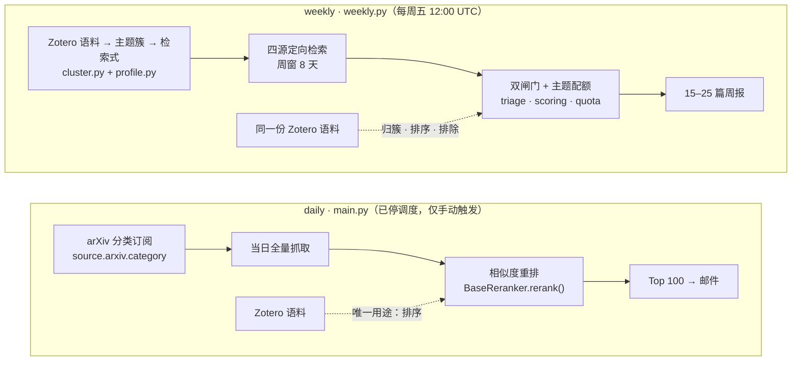
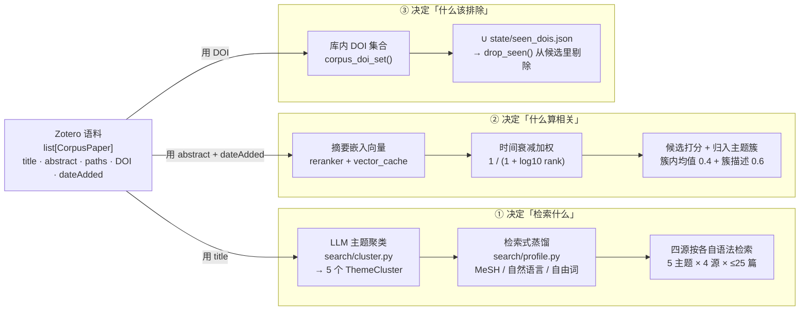
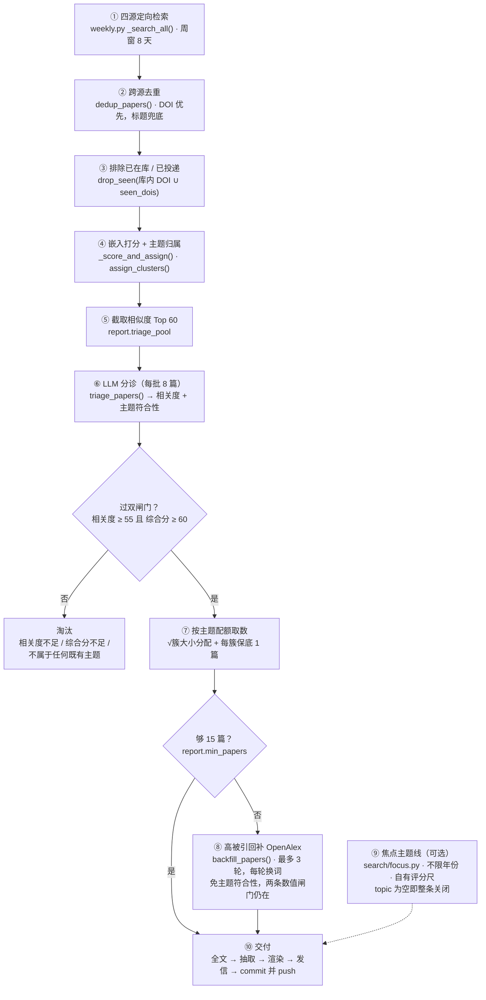

# 基于 Zotero 库的检索逻辑 — 逻辑图、流程图与关键节点

> 这份文档回答一个问题：**这个仓库到底是怎么用你的 Zotero 库去找新文献的。**
> 不讲怎么部署（那是 [`cmc-weekly-setup.md`](cmc-weekly-setup.md)），也不讲当初为什么这么设计
> （那是 [`cmc-literature-weekly-plan.md`](cmc-literature-weekly-plan.md)），只讲现在跑着的代码是什么逻辑。
>
> 在线版（同样内容，图更清楚）：https://claude.ai/code/artifact/3b8bef5c-a3ad-4dd5-8e42-528e6487a007

---

## 1. 先分清两条链路

仓库名字还叫 arxiv-daily，但 `.github/workflows/main.yml` 已经拿掉了 `schedule`，日报链路只剩手动触发。
定时跑的是 `weekly.yml`，走 `WeeklyExecutor`。

两条链路**共用** Zotero 取数与路径过滤（`Executor.fetch_zotero_corpus` / `filter_corpus`），下游全部不同。
差别不在「换了几个源」，而在 **检索范围由谁决定**：

- **daily**：检索范围写死在 `source.arxiv.category`，跟你的 Zotero 库毫无关系。抓当天全量回来，再用库做排序。
- **weekly**：检索范围是从 Zotero 库里聚出来的主题反推出的检索式。

daily 链路里 Zotero 语料只有一条入边、只接在排序节点上。weekly 链路里它多出三条边：先生成检索式（决定抓什么），
再参与归簇与排序，最后它的 DOI 集合还被用作排除集。

以下第 2 节起只讲 weekly。

---

## 2. 逻辑图：语料的三重身份

读代码时最容易漏掉的一点：`fetch_zotero_corpus()` 拉回来的那一份 `list[CorpusPaper]`，
在 weekly 链路里被三个互不相干的子系统各用了一遍，用的还是**不同的字段**。

三条支路互不共享中间结果：

- ① **只读标题**。聚类提示词里放的是 title，摘要太长会撑爆响应 token 预算。
- ② **只读摘要**。嵌入的是 `abstract`，没有摘要的记录在检索阶段就被各 retriever 丢弃了。
- ③ **只读 DOI**。

所以：一篇 Zotero 文献缺摘要会影响排序但不影响检索式；缺 DOI 会导致它进不了排除集，**有可能被重新推荐给你**。

---

## 3. 流程图：一次 weekly 运行

主干是一条漏斗，每步都在减少候选。只有两处会往回加：不够数时的高被引回补，以及可选的焦点主题线。

虚线是默认关闭的旁路。注意回补走的是**放宽后的闸门**：不要求主题符合性（`require_theme_fit=False`），
但两条数值线仍然生效——「高被引」不等于免检。

---

## 4. 关键节点

按流程顺序。「为什么」这一栏基本都能在代码注释里找到对应的事故记录——这个仓库的注释写的是踩过的坑，
不是重复函数名。

### ⓪ 取语料 & 路径过滤 — `executor.py:42` / `executor.py:66`

pyzotero 拉全部 `conferencePaper / journalArticle / preprint`，**丢掉没有摘要的条目**，
再把每条的 collection key 递归还原成 `父/子/孙` 形式的路径字符串，然后用 `include_path` / `ignore_path` 的 glob 过滤。

> **要注意**：过滤是「任一路径命中即可」。一篇文献同时属于多个 collection 时，
> 只要有一个路径落进 `ignore_path` 就整篇被排除——排除优先于纳入。

### ① 主题聚类 — `search/cluster.py:187`

把全库标题喂给 LLM，要求聚成 5 个**方法学主题**并显式忽略项目代号（KJ103、BJ044 这类）。
超过 300 篇时按等间距抽样进提示词，抽样外的文献折进最大的簇。

缓存写在 `state/theme_clusters.json`，但命中条件不是指纹相等，而是 **缓存覆盖了当前语料 ≥ 85%**——
按标题匹配而非下标，所以 Zotero 里加几篇不会触发重聚类。

> **为什么不直接用 Zotero 的分类树**：目录里混着项目代号和方法学主题，直接当标签会把「KJ103」这种代号
> 当成一个研究主题。宁可多花一次 LLM 调用重新归纳。

### ② 检索式蒸馏 — `search/profile.py:70` / `search/profile.py:51`

每个簇取最多 25 个代表标题，让 LLM 产出四种形态：`mesh_terms`、`free_terms`、
`pubmed_query`（带 `[MeSH]`/`[tiab]` 限定的布尔式）、`plain_query`（自然语言）。

`query_for_source()` 按源发不同形态：

| 源 | 用哪种形态 | 原因 |
| --- | --- | --- |
| PubMed | `pubmed_query` | 支持完整布尔语法与 MeSH |
| Europe PMC / OpenAlex | `free_terms` OR 拼接（≤ 12 个） | 它们会把查询词 **AND** 起来 |
| Crossref | `plain_query` | 走的是自然语言相关度排序 |

> **这是实测出来的**：注释里记着首次线上运行的数据——同一条长自然语言查询，Crossref 返回 65 条，
> Europe PMC 和 OpenAlex 每个簇都返回 0 条，因为它们要求一条记录同时包含那二十几个词。

### ③ 四源检索 — `weekly.py:95` / `weeknum.py:26`

双重循环 `源 × 主题`，每格最多取 `per_cluster_limit`（25）篇，理论上限 4 × 5 × 25 = 500 篇。
任一源抛异常只 warning、返回空列表，不影响其它源。

时间窗是 **8 天而不是 7 天**：`week_window()` 从上一个周五取到本周五，相邻两周故意重叠一天，
防止周五当天午后才被索引的文献掉进两个窗口的缝隙里；重叠部分由跨周去重兜底。

### ④ 去重与排除 — `dedup.py:50` / `dedup.py:93`

先按归一化 DOI 合并，DOI 对不上再按**归一化标题**合并（即使两边 DOI 不同也合）。
保留第一次出现的那条，但把后来者独有的字段补进去（`pdf_url`、`journal`、`pub_date`、
`cited_by_count`、`full_text`、开放获取状态）。

然后减去 `corpus_doi_set(corpus) ∪ seen_dois.json`。

> **为什么标题也能合并**：有源会给对的记录挂错的 DOI。注释里点名了一篇
> "Protein persulfidation in plants…"，因为拒绝按标题合并，在同一期周报里以两个 DOI 出现了两次。
> 代价是两篇标题逐字相同的不同文献会被误合，权衡后接受。

### ⑤ 打分与归簇 — `weekly.py:132` / `reranker/base.py:8` / `search/cluster.py:235`

语料按入库时间倒序，算候选 × 语料的余弦相似度矩阵，再按 `1/(1+log10(rank+1))` 归一化后的
时间衰减权重加权求和 × 10 得到 `paper.score`。**越新加进 Zotero 的文献，对分数的影响越大。**

归簇用两个信号混合：

- 候选对该簇**语料成员的相似度均值**（权重 0.4；用均值而非最大值，避免一次偶然的高分左右结果）
- 候选对该簇**一句话描述的相似度**（权重 0.6，`search.cluster_assignment_description_weight` 可调）

> **为什么要混两个信号**：只用语料均值的话，一篇只是共享表面词汇的文献可以压过真正对题的文献；
> 簇描述是一句刻意写出来的主题概括，是更锐利的信号。这一路失败会自动退回纯语料均值。

### ⑥ 双闸门 — `weekly.py:173` / `triage.py:318` / `scoring.py:59`

先按 `score` 排序取前 60 篇（`triage_pool`）送 LLM，每批 8 篇。分诊给出 0–100 的相关度、
一句话理由、药物模态，以及**它属于哪个真实主题（或「无」）**。

然后 `score_papers()` 加分：命中期刊白名单 +10，作者单位命中药企/CDMO 名单 +8。
最后两条线：`relevance ≥ 55` 且 `rank_score ≥ 60`。

> **为什么是两条线而不是一条**：只有综合分一条线时，一篇 42 分（「只有名词重合」那一档）的文献
> 靠加分就能凑到 60 分进报告。相关度那条线是加分**不能**跨过的底线：加分只在合格者之间分高下，
> 不能把不合格的抬进来。

> **主题符合性是第三道，独立于相关度**：「是不是生物药 CMC 相关」和「属不属于你库里真有的那几个主题」
> 是两个问题。少了后者，一篇抗体可开发性的文献会因为嵌入相似度最高，被硬塞进「宿主细胞蛋白分析」
> 主题里发出去。判为「无」的正常候选直接淘汰——走的是既有的「未判定」通道（把 `triage` 置空），
> 没有新增一套闸门逻辑。

### ⑦ 主题配额 — `quota.py:32` / `quota.py:81`

名额按各簇语料量的**平方根**分配（最大余数法），再给每簇一个保底名额，欠的名额从分得最多的簇里扣回来。
取数时某簇候选不够，剩余名额按分数释放给其它簇。

> **为什么开平方**：相似度是对全语料求和的，全局 Top-N 会被你收藏最多的那个主题吃光。
> 实测最大簇和最小簇差 28 倍，开方把这个差压到约 5 倍，小主题才不至于一篇都排不进去。

> **关键顺序**：配额是在**过闸幸存者之间**分配的，不是在全部候选之间。先分配再过闸，就会出现
> 「5 个主题 × 5 个名额必须从候选列表尾巴上凑够」——那正是钠离子电池负极材料混进 CMC 阅读清单的原因。

### ⑧ 不够数时回补 — `backfill.py:41` / `search/profile.py:152`

少于 `min_papers`（15）时，用各主题的 `plain_query` 去 OpenAlex 按被引量降序抓，超采 3 倍。
**最多 3 轮**：一轮不够就调 `alternate_queries()` 让 LLM 换一批说法（同义词、邻近方法学、
上位或下位概念），重复用过的检索式会被丢弃。

> **为什么必须换词**：同一条检索式重跑只会返回同一批文献，白烧一轮。这跟系统评价里某个子主题
> 覆盖不足时换角度重检是同一个动作。

> **为什么放宽主题符合性**：回补是按全 OpenAlex 的被引量捞经典文献的，要求它同时落进本周聚出的
> 5 个窄主题几乎全军覆没。注释记录了某次运行 13 个回补候选被主题符合性砍掉 13 个（相关度和分数
> 一个都没砍），最后发了一份没有任何经典文献的 5 篇周报。

### ⑨ 焦点主题线（可选） — `search/focus.py:224` / `triage.py:283`

`search.focus.topic` 非空才启用。它把主题拆成 **subject_terms（研究对象）** 和
**aspect_terms（切面）**，对 Europe PMC / OpenAlex 生成 `(对象组) AND (切面组)`——
而库内主题用的是全部 OR。

这条线**不限年份**（`_ALL_TIME_START = 1900-01-01`），用自己的评分尺（`triage_for_topic`）
和自己的相关度下限（默认 75）。

> **为什么对象组要 AND 而不是 OR**：库内主题是一片相关概念，任一命中都算对题；焦点主题点名的是
> 一个具体对象，把它 OR 进切面词里就等于让对象变成可选项。注释里的实例：主题是乌司他丁的酶抑制动力学，
> OR 拼接后 Europe PMC 老老实实返回了一堆研究别的酶的动力学论文。

### ⑩ 交付与落盘 — `fulltext/resolver.py:94` / `weekly.py:340` / `publish.py`

按「源自带 PDF 链接 → Unpaywall → Europe PMC」的阶梯取开放获取全文，LLM 抽取配置好的字段
（背景 / 待解决问题 / 方法 / 结论 / 洞见），渲染 Markdown + HTML，发信，最后
**先发信、再写 `seen_dois.json`**，然后 commit 并 push。

> **顺序不能反**：先记 DOI 再发信，一旦发信失败，这批文献会从此被所有后续周报屏蔽，而你什么都没收到。
> 同理 push 失败会直接抛 `RuntimeError`——邮件已经发出去了，commit 留在 runner 上等于报告、
> seen 状态、缓存全部丢失，而且没有任何其它迹象能暴露这个损失。

---

## 5. 跨周状态与降级策略

GitHub Actions 的 runner 是一次性的，所以所有需要跨周存在的东西都必须 commit 回仓库。
这几个文件就是这条链路的全部持久状态：

| 文件 | 内容 | 失效条件 |
| --- | --- | --- |
| `state/theme_clusters.json` | 主题簇及其成员标题 | 覆盖当前语料 < 85% 时重建 |
| `state/query_profiles.json` | 每个簇的四种检索式 | 簇名集合的指纹变化时重建 |
| `state/seen_dois.json` | 历史已投递的 DOI | 只增不减，永不失效 |
| `state/corpus_vectors.npz` | 语料摘要的嵌入向量（`reranker.vector_cache` 默认 null，即关闭） | 换嵌入模型即整体作废 |

**降级贯穿全链路**：聚类失败退回单簇、检索式蒸馏失败退回簇名、簇描述相似度失败退回纯语料均值、
向量缓存不可读就当场重算、单个源挂掉只 warning、分诊单批失败重试一次再逐篇重试。

但有两处刻意**不缓存降级结果**：单簇兜底和空的 `pubmed_query` 都不会写进缓存文件——
缓存是要 commit 的，一次瞬时 API 错误会把周报永久钉死在退化状态上。

---

## 6. 最容易踩的三个点

1. Zotero 里**没有摘要**的条目在 `fetch_zotero_corpus()` 就被过滤掉了，它既不参与聚类也不参与打分。
2. Zotero 里**没有 DOI** 的条目进不了排除集，同一篇文献有可能被当成新文献重新推荐给你。
3. `report.max_papers`（25）只管新鲜候选的配额总量，`min_papers`（15）是触发回补的下限——
   两个是独立开关，不是一个区间。回补尽力而为，OpenAlex 凑不够时周报会更短，日志里有 WARNING 说明原因。

---

## 参考

- 部署与首跑实测记录：[`cmc-weekly-setup.md`](cmc-weekly-setup.md)
- 架构决策的完整讨论过程：[`cmc-literature-weekly-plan.md`](cmc-literature-weekly-plan.md)
- 开发历史与各阶段改了什么：[`../CHANGELOG.md`](../CHANGELOG.md)
- 项目全貌、目录结构、配置详解：[`../README.md`](../README.md)
